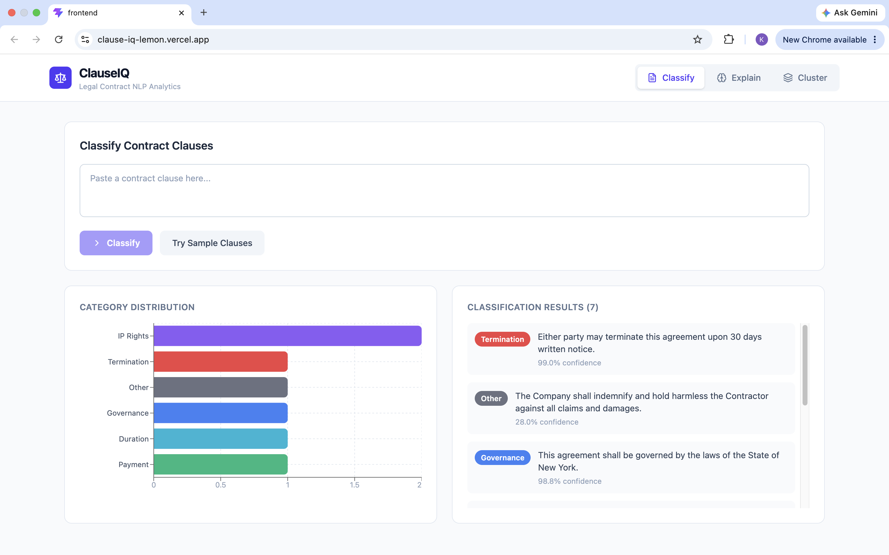
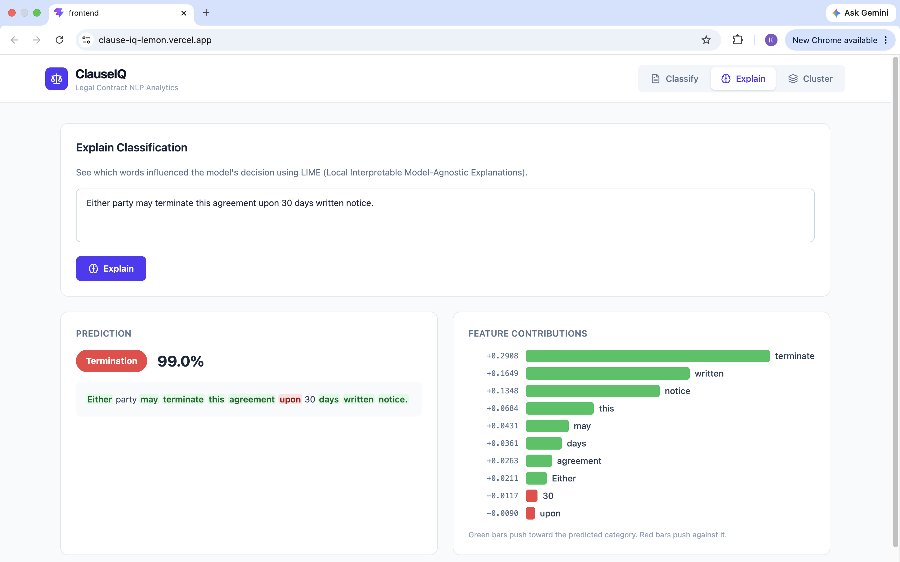
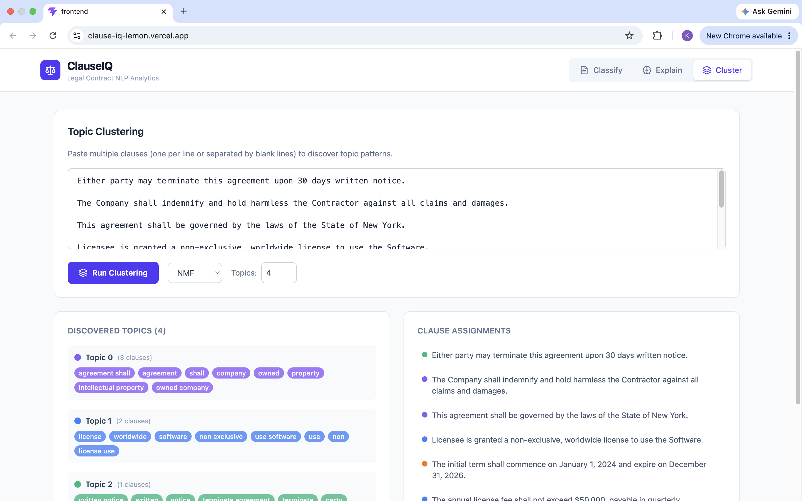

# ClauseIQ

**Legal Contract NLP Analytics Platform** — Classify, explain, and discover patterns in legal contract clauses using machine learning.

🔗 **[Live Demo](https://clause-iq-lemon.vercel.app)** · 📡 **[API Docs](https://clauseiq-sq4w.onrender.com/docs)** · 📂 **[GitHub](https://github.com/KhushiLakhlani/ClauseIQ)**

> ⚠️ The backend runs on Render free tier — first request may take ~30s to cold-start.

## What It Does

ClauseIQ analyzes legal contract text through three capabilities:

- **Classify** — Assigns contract clauses to 7 legal categories (Termination, Liability, IP Rights, Governance, Payment, Duration, Other) with confidence scores
- **Explain** — Uses LIME to show which specific words drove each classification decision
- **Cluster** — Discovers topic patterns across multiple clauses using KMeans or NMF

## Screenshots

### Clause Classification


### LIME Explainability


### Topic Clustering


## Model Performance

| Metric | Value |
|--------|-------|
| Test Accuracy | **90.5%** |
| Macro F1 Score | **0.86** |
| Cross-validation F1 (5-fold) | 0.860 ± 0.007 |
| Training Samples | 11,058 |
| Test Samples | 2,765 |
| Categories | 7 |

**Per-category F1 scores:**

| Category | F1 Score | Support |
|----------|----------|---------|
| Other | 0.978 | 615 |
| Duration | 0.909 | 508 |
| IP Rights | 0.904 | 558 |
| Payment | 0.887 | 467 |
| Governance | 0.879 | 323 |
| Liability | 0.837 | 194 |
| Termination | 0.746 | 100 |

## Tech Stack

| Layer | Technology |
|-------|-----------|
| **ML Pipeline** | scikit-learn (TF-IDF + Logistic Regression), LIME |
| **Backend** | FastAPI, Python 3.9 |
| **Frontend** | React, TypeScript, Vite, Tailwind CSS, Recharts |
| **Data** | CUAD Dataset (510 contracts, 13,823 clauses) |
| **Deployment** | Vercel (frontend), Render (backend) |

## Architecture
clauseiq/
├── backend/
│   ├── app/
│   │   ├── main.py                  # FastAPI app + CORS
│   │   ├── routers/
│   │   │   ├── analysis.py          # /classify, /classify/batch, /explain
│   │   │   ├── clustering.py        # /cluster
│   │   │   ├── health.py            # /health
│   │   │   └── documents.py         # /documents/upload
│   │   └── services/
│   │       ├── classifier.py        # TF-IDF + LR pipeline wrapper
│   │       ├── explainer.py         # LIME explanation generator
│   │       ├── clustering.py        # KMeans + NMF topic modeling
│   │       ├── preprocessor.py      # Legal text cleaning
│   │       └── data_loader.py       # CUAD dataset parser
│   ├── train.py                     # Model training pipeline
│   ├── ml_models/                   # Trained model artifacts
│   └── tests/                       # 43 unit tests
├── frontend/
│   └── src/App.tsx                  # React dashboard
└── data/                            # CUAD dataset (gitignored)

## API Endpoints

| Method | Endpoint | Description |
|--------|----------|-------------|
| POST | `/api/v1/classify` | Classify a single clause |
| POST | `/api/v1/classify/batch` | Classify multiple clauses |
| POST | `/api/v1/explain` | LIME explanation for a clause |
| POST | `/api/v1/cluster` | Topic modeling on clause set |
| GET | `/api/v1/health` | Health check |

## Run Locally

### Backend
```bash
cd backend
python -m venv venv && source venv/bin/activate
pip install -r requirements.txt
python train.py
uvicorn app.main:app --reload --port 8000
```

### Frontend
```bash
cd frontend
npm install
npm run dev
```

## Key Design Decisions

- **TF-IDF + Logistic Regression over transformers** — 942KB model vs 400MB+ BERT, with 90.5% accuracy and full LIME interpretability
- **7 categories from 41 CUAD types** — Grouped to avoid class imbalance; smallest class (Termination) has 499 samples
- **Balanced class weights** — Compensates for 6:1 ratio between largest and smallest categories
- **Macro F1 as primary metric** — Treats all categories equally regardless of size
- **Substring matching for category mapping** — More robust than exact match against dataset label drift

## Dataset

Built on the [CUAD dataset](https://www.atticusprojectai.org/cuad) — 510 commercial legal contracts with 13,000+ expert-annotated clause spans across 41 clause types, created by The Atticus Project.

## Author

**Khushi Lakhlani** — MS Information Systems, Northeastern University

[](https://linkedin.com/in/khushilakhlani)
[](https://github.com/KhushiLakhlani)
